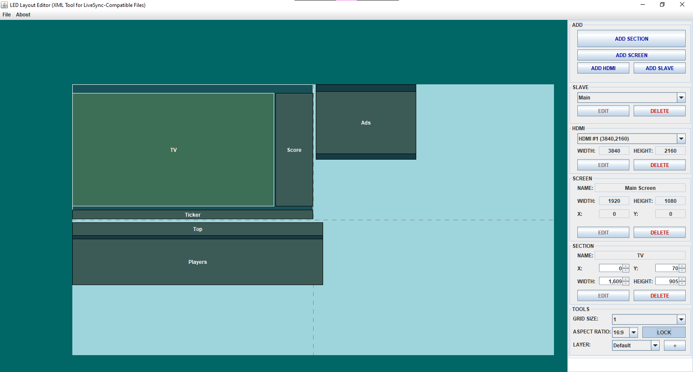
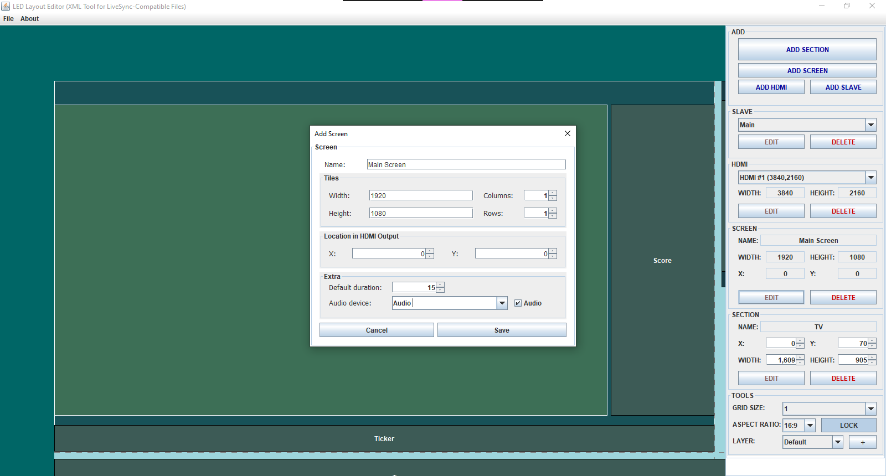

# LED Layout Editor (XML Tool for ANC LiveSync-Compatible Files)

A visual tool for editing XML files compatible with ANC's LiveSync software. This editor streamlines the creation and modification of LED screen layouts using a device hierarchy similar to the one employed by LiveSync.

> ⚠️ This software is **not affiliated with ANC or the LiveSync software**. It is an independent tool developed for educational and personal use. Commercial use is strictly prohibited.

---

## 🖼️ Description

This tool allows editing of XML files used by LiveSync, enabling users to visually configure a hierarchical system of LED displays with the following structure:

- **Slaves** → contain multiple **HDMI outputs**.
- **HDMI outputs** → contain several **Screens**.
- **Screens** → are divided into multiple **Sections** (visible regions).

Currently supports:

- ✅ Importing existing XML files.
- ✅ Visual and hierarchical editing.
- ✅ Exporting to LiveSync-compatible XML format.

---

## 🎮 Key Features

- 🖱️ **Interactive Visual Editor**
  - Drag & drop section editing.
  - Resizable areas with optional 16:9 aspect ratio lock.
  - Zoomable interface with scroll and snap-to-grid.
  - HDMI-based layer system to simplify section arrangement.

- 🧱 **Hierarchical Structure**
  - Slaves → HDMI → Screens → Sections.
  - Configurable properties at each level (offsets, resolution, names, content folder, etc.).

- 📁 **XML Import/Export**
  - Generated files can be opened in ANC's LiveSync software.

---

## 🧰 Technologies Used

- **Java SE 8** — Core programming language used for logic, UI, and XML processing.
- **Swing (Java GUI Toolkit)** — For building the graphical user interface.
- **DOM (Document Object Model)** — For XML parsing and manipulation.
- **NetBeans 8.2** — Main development environment.
- **JAR packaging** — For standalone distribution.

---

## 🧪 Requirements

- Java 8 or higher.
- Compatible with Windows, macOS, and Linux.
- No installation required: standalone `.jar` executable available.

---

## 🚀 How to Run

1. Make sure Java is installed.
2. Extract the contents of the `LED Layout Editor v1.0.0-beta.rar` file.
3. Run `LEDLayoutEditor.jar`.

---

## 📷 Screenshots

 
 
 

---

## 📄 License

This project is licensed under the [Creative Commons Attribution-NonCommercial 4.0 International License](https://creativecommons.org/licenses/by-nc/4.0/).

You are free to:

- **Share** — copy and redistribute the material in any medium or format.
- **Adapt** — remix, transform, and build upon the material.

**Under the following terms:**

- **Attribution** — You must give appropriate credit, provide a link to the license, and indicate if changes were made.
- **NonCommercial** — You may not use the material for commercial purposes.

> © 2025 Brandon Iván Covarrubias Minez.